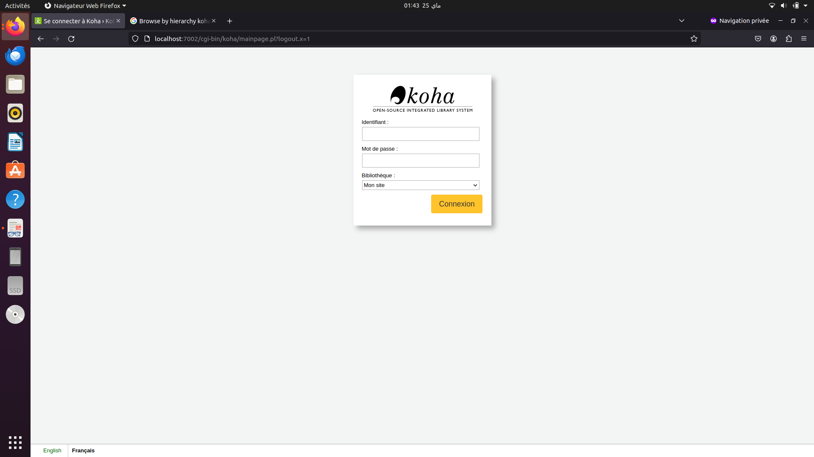

# University Library Management System (Bachelor's final project)

Bachelor's final project documenting and customizing a university-library deployment based on Koha.

## Verified scope

The academic material covers requirements analysis, UML design, Koha installation and configuration, OPAC and staff workflows, cataloguing, circulation, reservations, members, reports, mobile views and course reserves. This repository publishes only attributable customization samples and privacy-reviewed academic documentation; it does not redistribute Koha itself.

## Repository contents

- `customizations/opac.css` — submitted OPAC visual customization.
- `customizations/opac-main-user-block.html` — submitted carousel/user-block customization.
- `images/koha-staff-login.png` — reviewed local login screenshot with empty credential fields.
- [French bachelor's report (privacy-redacted PDF)](docs/academic-report-fr-redacted.pdf) — contact details and screenshots containing member records were removed from the public copy.
- [French defence presentation (PPTX)](presentations/koha-presentation-fr.pptx).

No project video was found.

## Installation and use

Install a compatible Koha release from the official project documentation, then apply the CSS and user-block HTML through the appropriate OPAC system preferences. Review the submitted snippets before deployment: the carousel contains historical `localhost` bibliographic links and remote cover-image references.

## Excluded material and privacy boundary

Database dumps, member and borrower records, MARC imports, live-site exports, downloaded dependencies and institutional contact blocks are not published. The report and presentation **are** published; only sensitive parts of the report copy were redacted. No credentials are present.

## Testing and limitations

The HTML and CSS were reviewed as static text. The report and presentation open successfully after sanitization. A Koha server was not available, the exact historical Koha version was not established, and the customizations were not redeployed. This is therefore an archival customization sample rather than a turnkey theme.

## Authors and supervision

- Adam El Akkaoui
- Mohammed Zaidouh

Academic supervision credited in the submitted report: Pr. Hatim Kharraz Aroussi.
