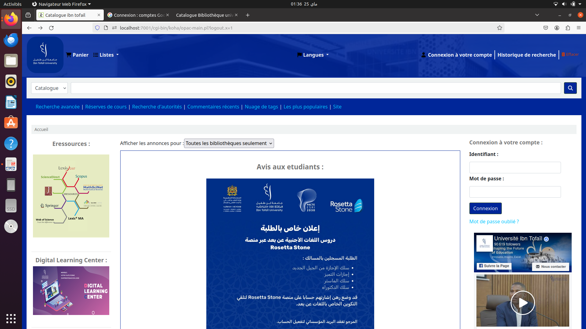

# University Library Management System (Bachelor's final project)

Bachelor's final project documenting and customizing a university-library deployment based on Koha.

*Customized OPAC homepage with Ibn Tofail University branding, catalogue access, announcements, electronic resources and user services.*

## Project scope

The academic material covers requirements analysis, UML design, Koha installation and configuration, OPAC and staff workflows, cataloguing, circulation, reservations, members, reports, mobile views and course reserves. This repository publishes only attributable customization samples and privacy-reviewed academic documentation; it does not redistribute Koha itself.

## Repository contents

- `customizations/opac.css` — OPAC visual customization.
- `customizations/opac-main-user-block.html` — customized OPAC carousel/user block.
- `images/koha-opac-home.png` — customized library OPAC homepage.
- `images/koha-staff-login.png` — Koha staff login screen from the project environment.
- [French bachelor's report (privacy-redacted PDF)](docs/academic-report-fr-redacted.pdf).
- [French defence presentation (PPTX)](presentations/koha-presentation-fr.pptx).

The report covers requirements analysis, UML design, Koha installation and configuration, OPAC and STAFF interfaces, cataloguing, circulation, reservations, members, reports, mobile access and course reserves.

## Installation and use

Install a compatible Koha release from the official project documentation, then apply the CSS and user-block HTML through the appropriate OPAC system preferences. Review the submitted snippets before deployment: the carousel contains historical `localhost` bibliographic links and remote cover-image references.

## Results and perspectives

The project delivers a web solution for university-library management by integrating and customizing the open-source Koha platform. The report highlights the design of both the **OPAC** and **STAFF** interfaces, with a clear structure and intuitive access to library services. The OPAC uses a blue visual identity aligned with Ibn Tofail University.

The report proposes several future improvements:

- expand access to digital and electronic resources;
- introduce virtual collaborative workspaces with document sharing, videoconferencing and project-management tools;
- strengthen user engagement through awareness activities and incentive programs.

## Authors and supervision

- Adam El Akkaoui
- Mohammed Zaidouh

Academic supervision credited in the submitted report: Pr. Hatim Kharraz Aroussi.
